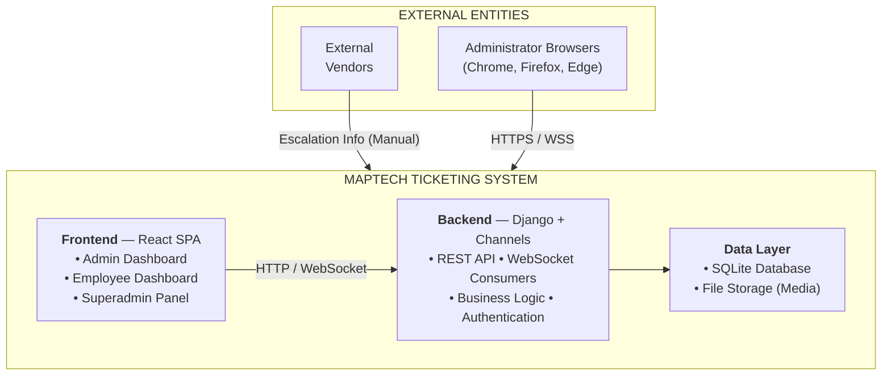
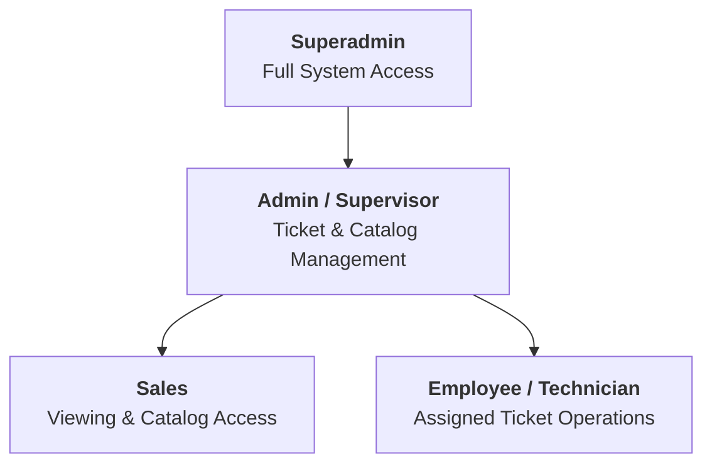

# 4. SYSTEM OVERVIEW

## 4.1 System Description

The Maptech Ticketing System is a web-based IT service management platform designed to digitize and streamline the end-to-end technical support workflow at Maptech Information Solutions Inc. The system manages the complete lifecycle of support tickets — from initial creation and client verification through technician assignment, diagnosis, resolution, and formal closure.

The system operates as a client-server web application with a RESTful API backend and a modern single-page application (SPA) frontend. It supports real-time communication through WebSocket connections, enabling live chat between supervisors and technicians as well as instant push notifications for critical events.

### Core Operational Flow

1. **Ticket Intake & Creation** — Supervisors or Sales create tickets on behalf of clients, capturing client information, product/equipment details, service type, and problem description.
2. **Client Call Verification & Priority** — For newly created sales tickets, the call workflow is completed first: call log capture, ticket review, and priority confirmation.
3. **Supervisor Assignment** — Supervisors assign confirmed tickets to available technicians based on workload and expertise.
4. **Work Execution** — Technicians start work, diagnose issues, take action, and document findings.
5. **Escalation** — Tickets may be escalated internally (staff handoff) or externally (vendor/distributor/principal).
6. **Resolution Request** — Technicians upload proof and request closure (or submit for observation when monitoring is required).
7. **Closure with Feedback** — Supervisors review final output, submit technical staff feedback rating, and close the ticket.
8. **Knowledge Capture** — Resolution proofs can be published to the Knowledge Hub for organizational learning.

---

## 4.2 System Context

The Maptech Ticketing System operates within the following context:

### External Entity Interactions

| External Entity | Interaction Type | Description |
|----------------|-----------------|-------------|
| Web Browser | HTTPS / WSS | Users access the system through modern web browsers |
| External Vendors | Manual (via notes) | Escalation information is recorded in-system; direct integration is not yet implemented |
| HIBP API | HTTPS (outbound) | Password breach checking during password changes/resets |

---

## 4.3 Stakeholders

| Stakeholder | Role | Responsibility |
|-------------|------|---------------|
| Maptech Management | Business Owner | Defines business requirements, approves system direction, reviews reports |
| IT Operations Team | System Operations | Deploys, monitors, and maintains the system infrastructure |
| Development Team | System Development | Designs, develops, tests, and maintains the application codebase |
| Supervisors (Admins) | Primary Operations Leads | Manage ticket operations, assign technicians, monitor SLAs, and close tickets |
| Sales Team | Intake and Client Coordination | Create tickets, complete call and priority workflow, maintain client/product master data |
| Technicians (Employees) | Field Service Workers | Receive assignments, perform diagnostics, resolve issues, submit proofs |
| Superadmins | System Administrators | Manage user accounts, configure system settings, review audit logs |
| Clients (External) | Service Recipients | Report issues via phone/email; tracked in system by sales and supervisors |
| QA Team | Quality Assurance | Validates system functionality and performance through testing |

---

## 4.4 User Roles and Responsibilities

The system implements a role-based access control (RBAC) model with the following roles:

| Role | Description | Access Level |
|------|-------------|-------------|
| **Superadmin** | Highest-privilege system administrator. Full access to all features including user management, system configuration, audit logs, and retention policies. | Full system access |
| **Admin (Supervisor)** | Manages day-to-day ticket operations. Handles assignment/reassignment, escalation handling, ticket review, closure, feedback ratings, and catalog/service maintenance. | Full operational ticket control |
| **Sales** | Handles ticket intake and client coordination. Creates tickets, performs call verification and priority confirmation on sales-created tickets, and manages clients/products/categories. | Ticket intake and catalog management |
| **Employee (Technician)** | Assigned technical staff. Starts work, updates work fields, uploads proof, escalates/pass tickets, submits for observation, and requests closure. | Assigned-ticket execution and updates |

### Role Hierarchy

### Detailed Role Permissions

| Feature | Superadmin | Admin (Supervisor) | Sales | Employee (Technician) |
|---------|:----------:|:------------------:|:-----:|:---------------------:|
| View Dashboard & Stats | ✅ | ✅ | ✅ | ✅ (own) |
| Create Tickets | ✅ (API) | ✅ | ✅ (own intake) | ❌ |
| Assign Tickets | ❌ (no ticket UI) | ✅ | ❌ | ❌ |
| Start Work on Ticket | ❌ (no ticket UI) | ✅ (escalation handling) | ❌ | ✅ |
| Update Ticket Fields | ❌ (no ticket UI) | ✅ | ✅ (call review scope) | ✅ (assigned scope) |
| Escalate Internally | ❌ | ❌ | ❌ | ✅ |
| Pass Ticket | ❌ | ❌ | ❌ | ✅ |
| Escalate Externally | ❌ (no ticket UI) | ✅ | ❌ | ✅ |
| Request Closure | ❌ | ❌ | ❌ | ✅ |
| Close Ticket | ❌ (no ticket UI) | ✅ | ❌ | ❌ |
| Confirm Ticket | ❌ (no ticket UI) | ✅ | ✅ (own intake flow) | ❌ |
| Review Ticket | ❌ (no ticket UI) | ✅ | ✅ (own intake flow) | ❌ |
| Link Tickets | ❌ (no ticket UI) | ✅ | ❌ | ❌ |
| Manage Knowledge Hub | ❌ | ✅ | ❌ | ❌ |
| View Knowledge Hub | ❌ | ✅ | ❌ | ✅ |
| Manage Products | ❌ | ✅ | ✅ | ❌ |
| Manage Clients | ❌ | ✅ | ✅ | ❌ |
| Manage Categories | ❌ | ✅ | ✅ | ❌ |
| Manage Types of Service | ❌ | ✅ | ❌ | ❌ |
| Manage Call Logs | ✅ | ✅ | ✅ (ticket call workflow) | ✅ (ticket participant scope) |
| Submit Feedback Ratings | ❌ | ✅ | ❌ | ❌ |
| View Audit Logs | ✅ | ✅ (scoped) | ✅ (scoped) | ❌ |
| Export Audit Logs | ✅ | ✅ | ✅ | ❌ |
| Manage Users | ✅ | ❌ | ❌ | ❌ |
| Manage Announcements | ✅ | ❌ | ❌ | ❌ |
| Manage Retention Policy | ✅ | ❌ | ❌ | ❌ |
| View Announcements | ✅ | ✅ | ✅ | ✅ |
| Chat (Ticket Channel) | ✅ | ✅ | ✅ | ✅ |
| Receive Notifications | ✅ | ✅ | ✅ | ✅ |
| Update Profile | ✅ | ✅ | ✅ | ✅ |
| Change Password | ✅ | ✅ | ✅ | ✅ |

Notes:
Sales ticket visibility is scoped to tickets they created.
Supervisor-only assignment controls are enforced by the `IsSupervisorLevel` permission.

---

## 4.5 Operational Environment

### Hardware Requirements

| Component | Minimum | Recommended |
|-----------|---------|-------------|
| **Server CPU** | 2 cores | 4+ cores |
| **Server RAM** | 2 GB | 4+ GB |
| **Server Storage** | 10 GB (SSD) | 50+ GB (SSD) for media/attachments growth |
| **Client Device** | Any device with a modern web browser | Desktop or laptop for optimal admin experience |

### Software Requirements

| Component | Requirement |
|-----------|-------------|
| **Server OS** | Windows 10+, Linux (Ubuntu 20.04+), macOS |
| **Python** | 3.10 or higher |
| **Node.js** | 18.x or higher (for frontend build) |
| **Database** | SQLite 3 (development); PostgreSQL recommended for production |
| **Web Browser** | Chrome 90+, Firefox 88+, Edge 90+, Safari 14+ |

### Network Infrastructure

| Aspect | Details |
|--------|---------|
| **Protocol** | HTTPS (recommended for production), HTTP (development) |
| **WebSocket** | WSS (production) / WS (development) for real-time features |
| **Ports** | Backend: 8000 (default), Frontend: 3000 (development proxy) |
| **CORS** | Configurable allowed origins via environment variables |
| **Bandwidth** | Standard broadband; system is optimized for low bandwidth |

### Security Environment

| Aspect | Details |
|--------|---------|
| **Authentication** | JWT (JSON Web Tokens) with access/refresh token pair |
| **Password Hashing** | Argon2 (primary), PBKDF2, BCrypt, Scrypt (fallback chain) |
| **Token Lifetime** | Access: 1 day, Refresh: 30 days (configurable) |
| **API Security** | Token-based authentication required for all protected endpoints |
| **WebSocket Security** | JWT token passed via query string for WebSocket authentication |
| **Password Breach Check** | Integration with HIBP API for compromised password detection |

---

*End of Section 4*
