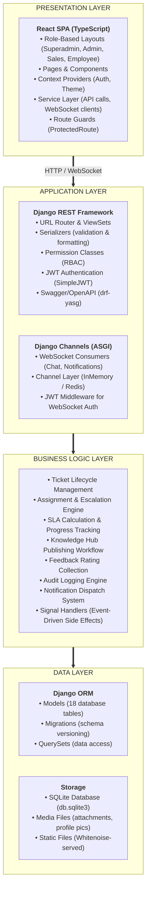
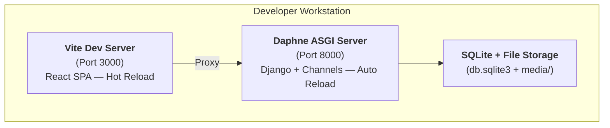
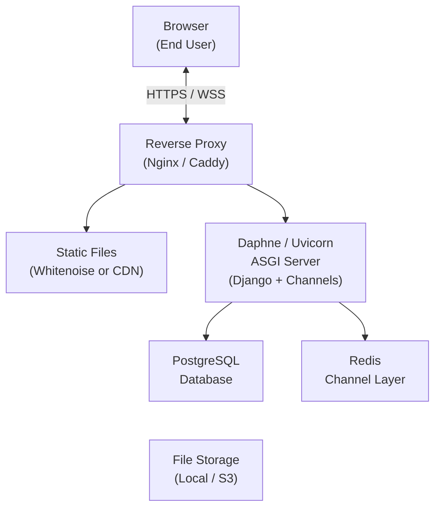

# 5. SYSTEM ARCHITECTURE

## 5.1 Architecture Overview

The Maptech Ticketing System follows a modern **client-server architecture** with a clear separation of concerns between the presentation layer (React SPA), the application/business logic layer (Django REST Framework + Channels), and the data layer (SQLite/PostgreSQL + filesystem).

The system supports both synchronous HTTP request-response communication (for REST API operations) and asynchronous bidirectional communication (for real-time chat and notifications via WebSockets).

---

## 5.2 Architecture Design Pattern

The system employs a combination of established architectural patterns:

| Pattern | Application |
|---------|------------|
| **Client-Server** | React frontend (client) communicates with Django backend (server) via HTTP and WebSocket |
| **MVC / MTV** | Django follows the Model-Template-View pattern (analogous to MVC); DRF extends this with Serializers |
| **RESTful API** | Backend exposes a stateless REST API following REST conventions for CRUD operations |
| **Event-Driven** | Django signals trigger side-effects (notifications, audit logging) on model events |
| **Layered Architecture** | Presentation → Application → Business Logic → Data access layers |
| **Repository Pattern** | Django ORM acts as the data access layer, abstracting database queries |
| **Observer Pattern** | WebSocket consumers observe and broadcast real-time events to connected clients |

---

## 5.3 Logical Architecture

The system is organized into the following logical layers:

### Layer Descriptions

| Layer | Description |
|-------|-------------|
| **Presentation Layer** | The React SPA handles all user interface rendering, form inputs, navigation, and real-time UI updates. It communicates with the backend exclusively through the service layer (HTTP API calls and WebSocket connections). |
| **Application Layer** | Django REST Framework handles HTTP request routing, input validation via serializers, authentication, and permission enforcement. Django Channels handles WebSocket lifecycle and real-time message routing. |
| **Business Logic Layer** | Core domain logic including ticket lifecycle state management, assignment algorithms, SLA tracking, escalation workflows, audit logging, and notification dispatch. Implemented within ViewSet methods and Django signal handlers. |
| **Data Layer** | Django ORM provides database abstraction. Models define the schema. Migrations handle schema evolution. File storage handles media uploads including ticket attachments and profile pictures. |

---

## 5.4 Physical Architecture

### Development Environment

### Production Environment (Recommended)

---

## 5.5 Component Architecture

| Component | Description |
|-----------|-------------|
| **React SPA** | Single-page application built with React 18, TypeScript, React Router, and Tailwind CSS. Produces a static build served by the backend or a CDN. |
| **Vite** | Frontend build tool with HMR (Hot Module Replacement) for development and optimized production builds. Proxies API/WebSocket requests to the Django backend in development. |
| **Django REST Framework** | Provides REST API viewsets, serializers for input/output, permission classes for authorization, and browsable API for development. |
| **Django Channels** | Extends Django with ASGI support for WebSocket handling. Provides the channel layer for broadcasting messages to connected clients. |
| **Daphne** | ASGI server that serves both HTTP and WebSocket connections. Runs the Django application with full async support. |
| **SimpleJWT** | Handles JWT token generation, validation, and refresh. Provides access and refresh token management. |
| **drf-yasg** | Auto-generates Swagger/OpenAPI documentation from DRF viewsets and serializers. Provides Swagger UI and ReDoc interfaces. |
| **Django ORM** | Abstracts database operations. Manages 18 models with relationships, indexes, and constraints. |
| **SQLite** | Default development database. File-based, zero-configuration. |
| **Whitenoise** | Serves static files directly from the Django application without requiring a separate web server. Compresses and caches static assets. |
| **Argon2** | Primary password hashing algorithm. Memory-hard, resistant to GPU-based attacks. |
| **Pillow** | Image processing library for handling profile picture uploads, validation, and storage. |

---

## 5.6 Technology Stack

### Backend

| Layer | Technology | Version | Purpose |
|-------|-----------|---------|---------|
| Language | Python | 3.10+ | Server-side programming |
| Web Framework | Django | 4.2+ | Application framework |
| API Framework | Django REST Framework | 3.16.1 | REST API development |
| Authentication | djangorestframework-simplejwt | 5.5.1 | JWT token management |
| WebSocket | Django Channels | 4.3.2 | Real-time WebSocket support |
| ASGI Server | Daphne | (bundled with Channels) | HTTP & WebSocket server |
| API Documentation | drf-yasg | 1.21.15 | Swagger/OpenAPI auto-generation |
| CORS | django-cors-headers | 4.9.0 | Cross-origin request handling |
| Password Hashing | argon2-cffi | 25.1.0 | Argon2 password hashing |
| Static Files | Whitenoise | 6.12.0 | Static file serving |
| Image Processing | Pillow | 12.1.1 | Profile picture handling |
| Environment Variables | python-dotenv | 1.2.2 | Environment configuration |
| HTTP Client | Requests | 2.32.5 | External API calls (HIBP) |
| Database | SQLite 3 (dev) / PostgreSQL (prod) | — | Relational data storage |

### Frontend (Primary — Maptech_FrontendUI-main)

| Layer | Technology | Version | Purpose |
|-------|-----------|---------|---------|
| Language | TypeScript | 5.5.4 | Type-safe JavaScript |
| UI Library | React | 18.3.1 | Component-based UI framework |
| Routing | React Router | 7.13.0 | Client-side routing |
| Styling | Tailwind CSS | 3.4.17 | Utility-first CSS framework |
| UI Utilities | Emotion | 11.13.3 | CSS-in-JS for dynamic styles |
| Icons | Lucide React | 0.522.0 | Icon library |
| Notifications/Toast | Sonner | 2.0.1 | Toast notification component |
| Charts | Recharts | 2.12.7 | Dashboard chart visualizations |
| Excel Export | xlsx-js-style | 1.2.0 | Data export to Excel format |
| Build Tool | Vite | 5.2.0 | Frontend build and dev server |
| Linting | ESLint + @typescript-eslint | 8.50.0 | Code quality enforcement |

### Frontend (Legacy — frontend/)

| Layer | Technology | Version | Purpose |
|-------|-----------|---------|---------|
| UI Library | React | 18.2.0 | Component-based UI framework |
| Routing | React Router | 6.12.0 | Client-side routing |
| Forms | React Hook Form | 7.71.1 | Form state management |
| OAuth | Azure MSAL, Google OAuth | Various | SSO authentication (planned) |
| Toast | React Toastify | 11.0.5 | Toast notifications |
| Build Tool | Vite | 5.0.0 | Frontend build tool |

---

## 5.7 Communication Protocols

| Protocol | Usage | Details |
|----------|-------|---------|
| **HTTP/HTTPS** | REST API calls | Standard request-response for CRUD operations. JSON payloads. |
| **WebSocket (WS/WSS)** | Real-time chat & notifications | Persistent bidirectional connection for live messaging and push notifications. |
| **JSON** | Data format | All API requests and responses use JSON serialization. |
| **JWT** | Authentication token | Bearer tokens passed in HTTP `Authorization` header and WebSocket query strings. |
| **Multipart/Form-Data** | File uploads | Used for ticket attachment and profile picture uploads. |

---

*End of Section 5*
