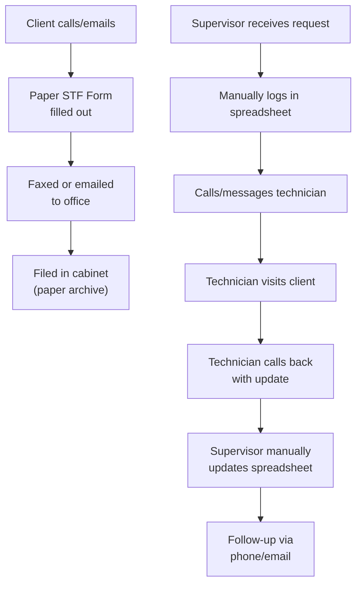
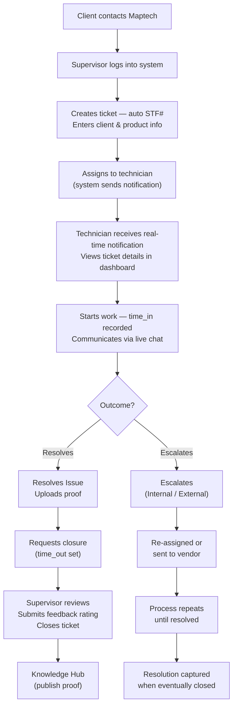
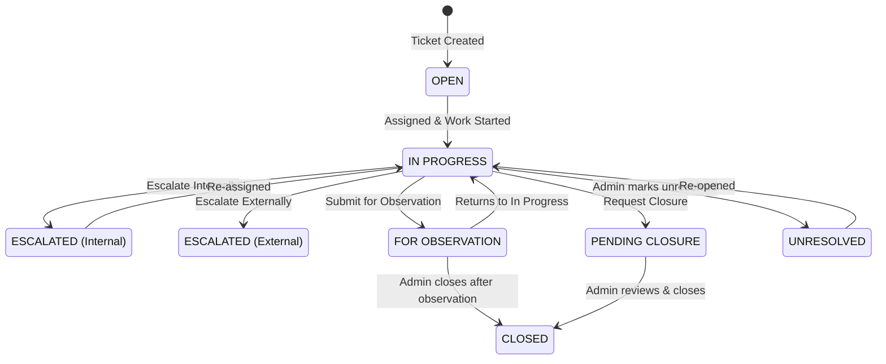
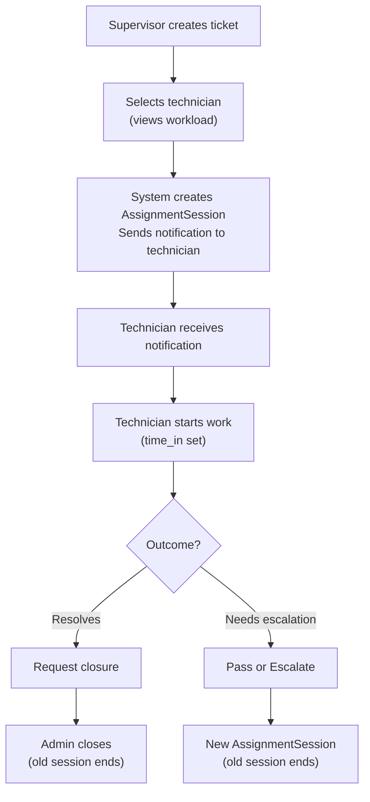
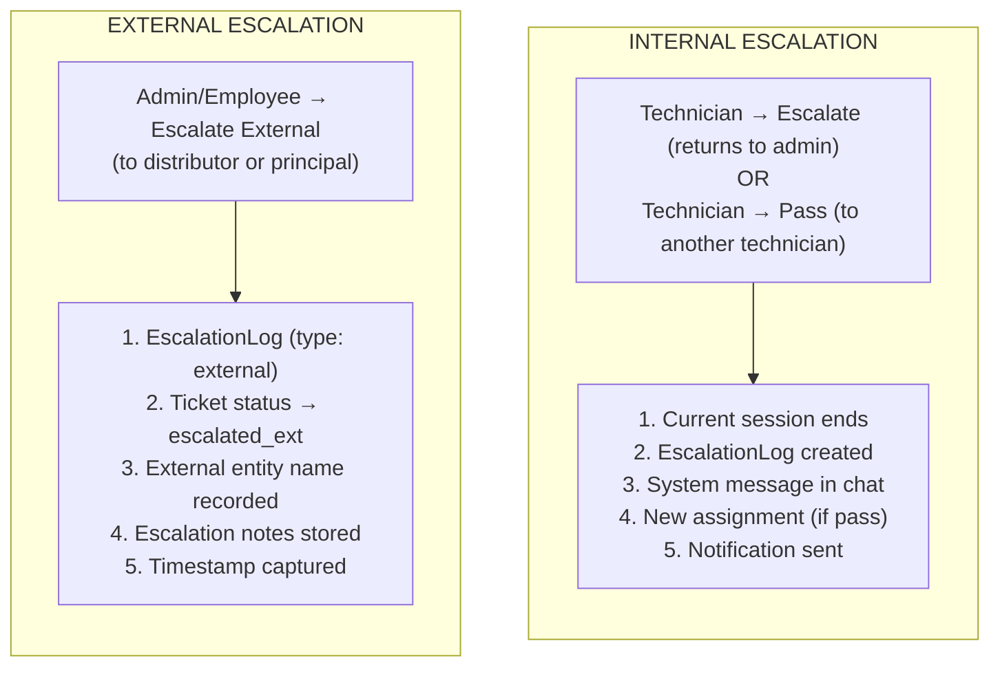
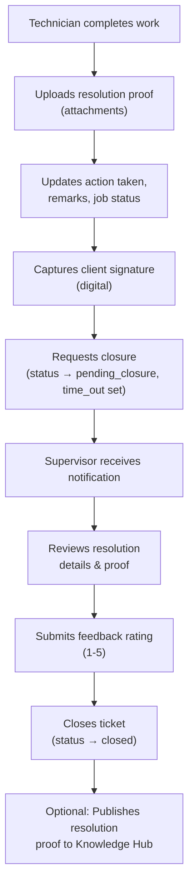

# 6. BUSINESS PROCESS MODEL

## 6.1 Business Workflow Overview

The Maptech Ticketing System supports a multi-stage ticket lifecycle with branching workflows for escalation, observation, and external referral. The primary workflow involves the following stages:

1. **Ticket Intake & Creation** — A supervisor or sales user creates a ticket with client and issue details.
2. **Call Verification & Priority Setup** — Sales-created tickets go through a call-status step (call completion + priority review/confirmation).
3. **Supervisor Assignment** — The supervisor assigns a confirmed ticket to an available technician.
4. **Work Execution** — The technician starts work, diagnoses, and takes action.
5. **Resolution, Observation, or Escalation** — The technician may submit for observation, request closure, or escalate.
6. **Closure** — The supervisor reviews final details, submits feedback rating, and closes the ticket.

---

## 6.2 Current Process (As-Is)

Prior to the ticketing system, the support process operated as follows:

### As-Is Process Challenges

| Challenge | Impact |
|-----------|--------|
| Paper-based STF forms | Prone to loss, damage, and illegibility |
| Spreadsheet tracking | No real-time updates, version control issues, no concurrent access |
| Phone/email coordination | Communication delays, no audit trail |
| Manual SLA tracking | Missed deadlines, no proactive alerts |
| No centralized knowledge base | Repeated troubleshooting of known issues |
| No audit trail | Inability to track who did what and when |

---

## 6.3 Proposed Process (To-Be)

With the Maptech Ticketing System, the process operates as follows:

### To-Be Process Benefits

| Benefit | Description |
|---------|-------------|
| Automated STF generation | Unique ticket numbers auto-assigned (STF-MT-YYYYMMDDXXXXXX) |
| Real-time notifications | Instant alerts for assignments, status changes, escalations |
| Live chat | Supervisors and technicians communicate in real-time within each ticket |
| SLA tracking | Automatic estimated resolution days and progress percentage |
| Audit trail | Every action logged with actor, timestamp, IP address, and changes |
| Knowledge retention | Resolution proofs published for organizational learning |
| Digital signatures | Clients sign off on completed work digitally |

### 6.3.1 Current Production Workflow Notes (April 2026)

The live implementation includes an intake split between Sales and Supervisors:

1. Sales can create tickets and complete client call verification.
2. Sales sets ticket priority during the call workflow and confirms the ticket.
3. Confirmed tickets are routed to supervisor assignment.
4. Supervisors assign technicians and continue lifecycle oversight.
5. Technicians execute, escalate/pass if needed, then request closure.
6. Supervisors submit feedback rating before final closure.

---

## 6.4 Process Diagrams

### 6.4.1 Ticket Lifecycle State Diagram

### Ticket Status Definitions

| Status | Code | Description |
|--------|------|-------------|
| Open | `open` | Ticket has been created but work has not yet started |
| In Progress | `in_progress` | Technician has started working on the ticket |
| Escalated (Internal) | `escalated` | Ticket escalated to another staff member internally |
| Escalated (External) | `escalated_external` | Ticket escalated to an external distributor or principal |
| Pending Closure | `pending_closure` | Technician has submitted resolution and requested closure |
| For Observation | `for_observation` | Ticket submitted for monitoring without immediate resolution |
| Closed | `closed` | Ticket has been formally closed by a supervisor |
| Unresolved | `unresolved` | Ticket marked as unresolvable |

### 6.4.2 Ticket Assignment Flow

Implementation note:
When a ticket is created by Sales, assignment is gated until call verification and priority confirmation are completed.

### 6.4.3 Escalation Workflow

### 6.4.4 Resolution & Closure Flow

---

*End of Section 6*
