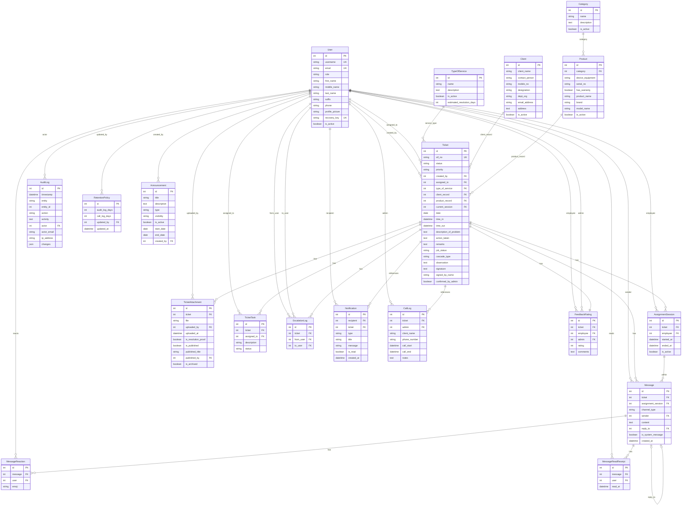
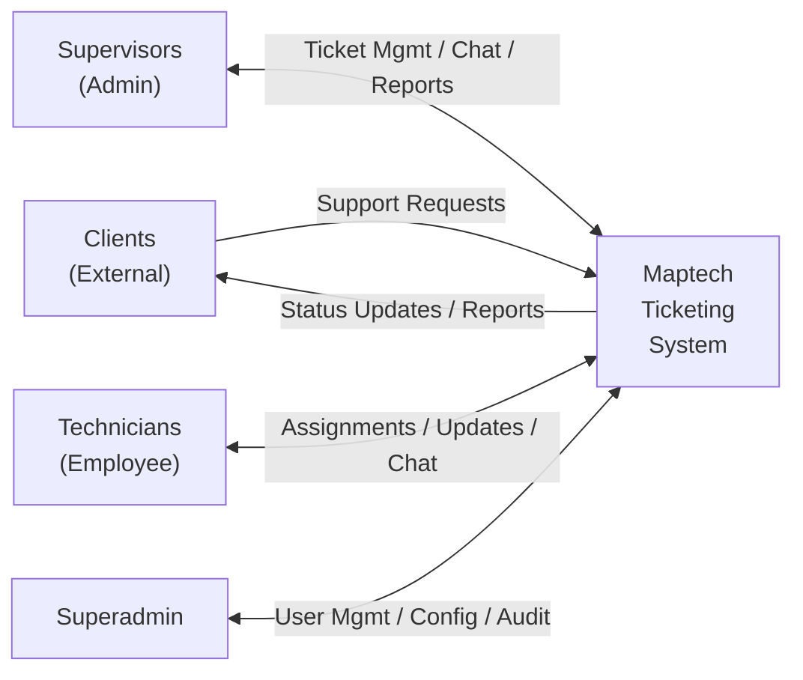
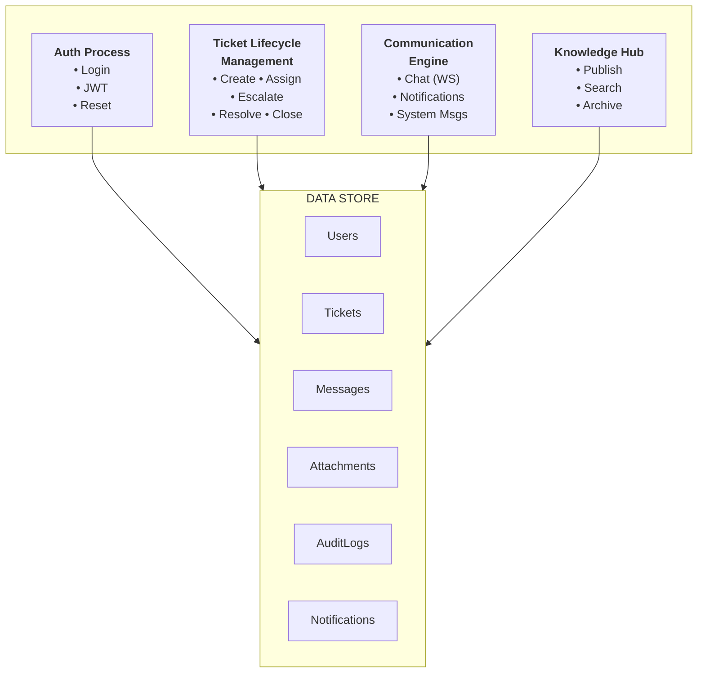
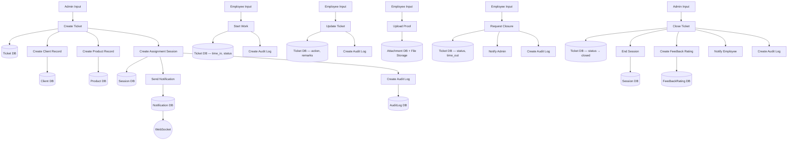

# 9. DATA ARCHITECTURE

## 9.1 Data Model Overview

The Maptech Ticketing System uses a relational data model implemented through Django's ORM. The database consists of **18 primary tables** (models) organized into the following logical groups:

| Group | Models | Purpose |
|-------|--------|---------|
| **Identity** | User | User accounts and authentication |
| **Core Ticketing** | Ticket, TicketAttachment, TicketTask | Ticket records, file attachments, and sub-tasks |
| **Assignment & Messaging** | AssignmentSession, Message, MessageReaction, MessageReadReceipt | Ticket assignment tracking and real-time communication |
| **Lifecycle & Escalation** | EscalationLog | Escalation history and tracking |
| **Audit & Compliance** | AuditLog | System-wide action audit trail |
| **Notifications** | Notification | User notifications for ticket events |
| **Support Operations** | CallLog, FeedbackRating | Call tracking and employee feedback ratings |
| **Catalog / Lookup** | TypeOfService, Category, Product, Client | Service types, product categories, equipment, and client records |
| **Configuration** | RetentionPolicy, Announcement | System configuration and announcements |

---

## 9.2 Entity Relationship Diagram (ERD)

---

## 9.3 Database Schema

### Table Listing

| Table Name | Description | Key Relationships |
|------------|-------------|-------------------|
| `users_user` | User accounts (extends Django AbstractUser) | Referenced by nearly all other tables |
| `tickets_ticket` | Core ticket records | FK → User (created_by, assigned_to), FK → TypeOfService, FK → Client, FK → Product, FK → AssignmentSession, M2M → self (linked_tickets) |
| `tickets_ticketattachment` | File attachments for tickets | FK → Ticket, FK → User (uploaded_by, published_by) |
| `tickets_tickettask` | Sub-tasks within tickets | FK → Ticket, FK → User (assigned_to) |
| `tickets_assignmentsession` | Employee assignment periods | FK → Ticket, FK → User (employee) |
| `tickets_message` | Chat messages | FK → Ticket, FK → AssignmentSession, FK → User (sender), FK → self (reply_to) |
| `tickets_messagereaction` | Emoji reactions on messages | FK → Message, FK → User |
| `tickets_messagereadreceipt` | Read receipts for messages | FK → Message, FK → User |
| `tickets_escalationlog` | Escalation history records | FK → Ticket, FK → User (from_user, to_user) |
| `tickets_auditlog` | System-wide audit trail | FK → User (actor) |
| `tickets_notification` | User notifications | FK → User (recipient), FK → Ticket |
| `tickets_calllog` | Support call records | FK → Ticket, FK → User (admin) |
| `tickets_feedbackrating` | Employee feedback ratings | OneToOne → Ticket, FK → User (employee, admin) |
| `tickets_typeofservice` | Service type definitions | Referenced by Ticket |
| `tickets_category` | Product categories | Referenced by Product |
| `tickets_product` | Product/equipment records | FK → Category, Referenced by Ticket |
| `tickets_client` | Client organization records | Referenced by Ticket |
| `tickets_retentionpolicy` | Singleton system config | FK → User (updated_by) |
| `tickets_announcement` | System announcements | FK → User (created_by) |

---

## 9.4 Data Dictionary

### User Table (`users_user`)

| Field Name | Type | Constraints | Description |
|------------|------|-------------|-------------|
| id | BigAutoField | PK, Auto-increment | Unique user identifier |
| username | CharField(150) | Unique, Required | Login username (auto-generated from initials) |
| email | EmailField | Unique, Required | User email address |
| password | CharField(128) | Required | Hashed password (Argon2) |
| role | CharField(12) | Choices: employee/sales/admin/superadmin | User role determining access level |
| first_name | CharField(150) | Optional | User's first name |
| middle_name | CharField(150) | Optional | User's middle name |
| last_name | CharField(150) | Optional | User's last name |
| suffix | CharField(3) | Optional | Name suffix (Jr., Sr., III) |
| phone | CharField(13) | Optional | Phone in +63XXXXXXXXXX format |
| profile_picture | ImageField | Optional, Nullable | Upload path: profile_pictures/ |
| recovery_key | CharField(39) | Unique, Auto-generated | Format: xxxx-xxxx-xxxx-xxxx-xxxx-xxxx-xxxx-xxxx |
| is_active | BooleanField | Default: True | Account activation status |
| is_staff | BooleanField | Default: False | Django admin access |
| is_superuser | BooleanField | Default: False | Django superuser flag |
| date_joined | DateTimeField | Auto | Account creation timestamp |
| last_login | DateTimeField | Nullable | Last successful login |

### Ticket Table (`tickets_ticket`)

| Field Name | Type | Constraints | Description |
|------------|------|-------------|-------------|
| id | BigAutoField | PK | Unique ticket identifier |
| stf_no | CharField(30) | Unique, Auto-generated | Service Ticket Form number (STF-MT-YYYYMMDDXXXXXX) |
| status | CharField(20) | Choices, Default: 'open' | Current ticket status |
| priority | CharField(10) | Choices, Optional | Ticket priority (low/medium/high/critical) |
| created_by | ForeignKey(User) | CASCADE | Supervisor who created the ticket |
| assigned_to | ForeignKey(User) | SET_NULL, Nullable | Currently assigned technician |
| type_of_service | ForeignKey | SET_NULL, Nullable | Selected service type |
| type_of_service_others | CharField(200) | Optional | Custom service type text |
| client_record | ForeignKey(Client) | SET_NULL, Nullable | Linked client organization |
| product_record | ForeignKey(Product) | SET_NULL, Nullable | Linked product/equipment |
| current_session | ForeignKey(Session) | SET_NULL, Nullable | Current active assignment session |
| date | DateField | Default: today | Ticket creation date |
| time_in | DateTimeField | Nullable | When technician started work |
| time_out | DateTimeField | Nullable | When technician submitted resolution |
| description_of_problem | TextField | Optional | Problem description from supervisor |
| action_taken | TextField | Optional | Technician's resolution actions |
| remarks | TextField | Optional | Additional notes |
| job_status | CharField(20) | Choices, Optional | Job completion status |
| cascade_type | CharField(20) | Choices, Optional | Internal/External cascade type |
| observation | TextField | Optional | Observation notes |
| signature | TextField | Optional | Base64-encoded digital signature |
| signed_by_name | CharField(200) | Optional | Name of person who signed |
| confirmed_by_admin | BooleanField | Default: False | Client verification confirmed |
| preferred_support_type | CharField(20) | Choices, Optional | Remote/Onsite/Chat/Call |
| estimated_resolution_days_override | PositiveIntegerField | Nullable | Manual SLA override |
| external_escalated_to | CharField(300) | Optional | External vendor name |
| external_escalation_notes | TextField | Optional | External escalation details |
| external_escalated_at | DateTimeField | Nullable | External escalation timestamp |
| linked_tickets | ManyToManyField(self) | Optional | Related tickets |
| created_at | DateTimeField | Auto | Record creation timestamp |
| updated_at | DateTimeField | Auto | Last modification timestamp |

### TicketAttachment Table (`tickets_ticketattachment`)

| Field Name | Type | Constraints | Description |
|------------|------|-------------|-------------|
| id | BigAutoField | PK | Unique attachment identifier |
| ticket | ForeignKey(Ticket) | CASCADE | Parent ticket |
| file | FileField | Required | Upload path: ticket_attachments/YYYY/MM/DD/ |
| uploaded_by | ForeignKey(User) | SET_NULL, Nullable | User who uploaded the file |
| uploaded_at | DateTimeField | Auto | Upload timestamp |
| is_resolution_proof | BooleanField | Default: False | Marks as resolution evidence |
| is_published | BooleanField | Default: False | Published to Knowledge Hub |
| published_title | CharField(300) | Optional | Knowledge article title |
| published_description | TextField | Optional | Knowledge article description |
| published_tags | JSONField | Default: [], Max 3 | Searchable tags |
| published_by | ForeignKey(User) | SET_NULL, Nullable | User who published |
| published_at | DateTimeField | Nullable | Publication timestamp |
| is_archived | BooleanField | Default: False | Archive status |

### Message Table (`tickets_message`)

| Field Name | Type | Constraints | Description |
|------------|------|-------------|-------------|
| id | BigAutoField | PK | Unique message identifier |
| ticket | ForeignKey(Ticket) | CASCADE | Parent ticket |
| assignment_session | ForeignKey(Session) | SET_NULL, Nullable | Session during which message was sent |
| channel_type | CharField(20) | Choices: 'admin_employee' | Communication channel |
| sender | ForeignKey(User) | CASCADE | Message author |
| content | TextField | Required | Message text content |
| reply_to | ForeignKey(Message) | SET_NULL, Nullable | Referenced message for replies |
| is_system_message | BooleanField | Default: False | Auto-generated system message flag |
| created_at | DateTimeField | Auto | Send timestamp |

### AuditLog Table (`tickets_auditlog`)

| Field Name | Type | Constraints | Description |
|------------|------|-------------|-------------|
| id | BigAutoField | PK | Unique log entry identifier |
| timestamp | DateTimeField | Auto, Indexed | When the action occurred |
| entity | CharField(30) | Choices, Indexed | Entity type (User/Ticket/etc.) |
| entity_id | PositiveIntegerField | Nullable | Affected entity's ID |
| action | CharField(20) | Choices, Indexed | Action type (CREATE/UPDATE/LOGIN/etc.) |
| activity | TextField | Required | Human-readable description |
| actor | ForeignKey(User) | SET_NULL, Nullable | User who performed the action |
| actor_email | EmailField | Optional | Snapshot of actor's email at time of action |
| ip_address | GenericIPAddressField | Nullable | Client IP address |
| changes | JSONField | Nullable | JSON diff of changed fields |

### Additional Tables

Additional data dictionary entries for remaining tables (EscalationLog, Notification, CallLog, FeedbackRating, TypeOfService, Category, Product, Client, RetentionPolicy, Announcement, AssignmentSession, TicketTask, MessageReaction, MessageReadReceipt) follow the same structure documented in Section 5.5 Component Architecture and the ERD above.

---

## 9.5 Data Flow Diagrams

### Level 0 — Context Diagram

### Level 1 — Major Processes

### Level 2 — Ticket Lifecycle Data Flow

---

*End of Section 9*
