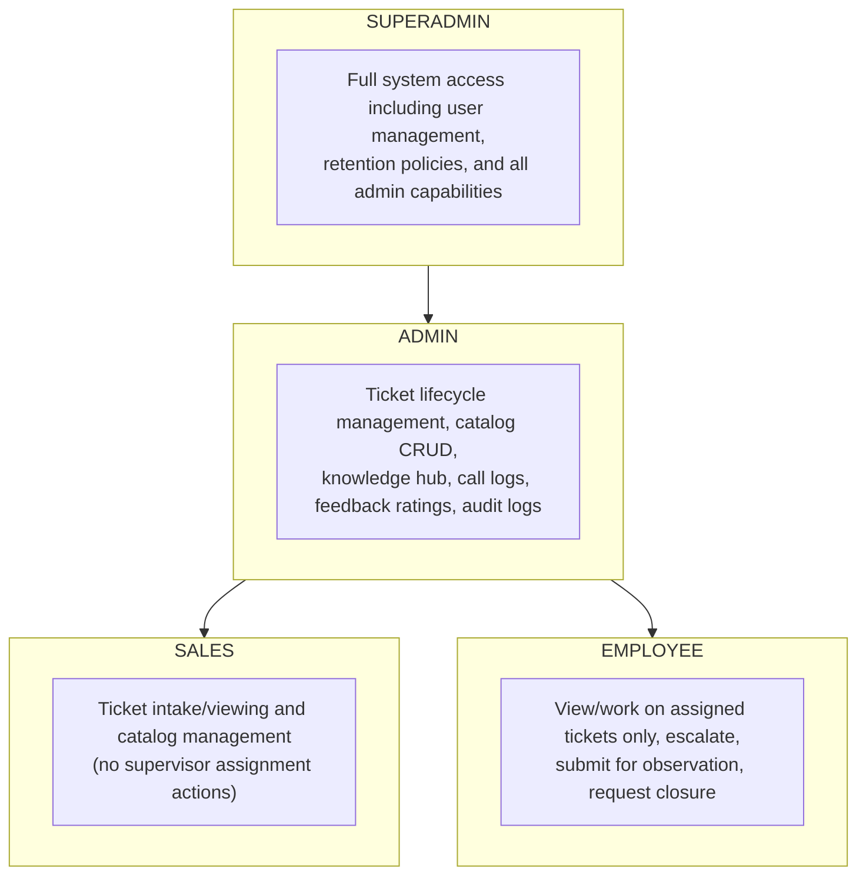

# 13. SECURITY ARCHITECTURE

## 13.1 Security Policies

The Maptech Ticketing System implements a defense-in-depth security model with the following policies:

| Policy | Description |
|--------|-------------|
| **Least Privilege** | Users are granted only the permissions necessary for their role. Employees cannot access admin functions; admins cannot access superadmin functions. |
| **Authentication Required** | All API endpoints (except login and password reset) require valid JWT authentication. |
| **Secure Password Storage** | Passwords are never stored in plaintext. Argon2 hashing (memory-hard, GPU-resistant) is used as the primary algorithm. |
| **Password Breach Checking** | New and changed passwords are validated against the HIBP (Have I Been Pwned) database to prevent use of known compromised credentials. |
| **Audit Trail** | All significant system actions are logged with actor identity, timestamp, IP address, and change details. |
| **Input Validation** | All API input is validated through DRF serializers before processing. |
| **CORS Protection** | Cross-origin requests are restricted to explicitly allowed origins. |
| **Session Rotation** | JWT refresh tokens rotate on each use, limiting the window of token reuse. |

---

## 13.2 Access Control Model

### Role-Based Access Control (RBAC)

The system implements RBAC with four hierarchical roles:



### Permission Classes

The system uses seven custom DRF permission classes, enforced at the API endpoint level:

| Permission Class | Logic |
|-----------------|-------|
| **IsEmployee** | `user.is_authenticated AND user.role == 'employee'` |
| **IsAdminLevel** | `user.is_authenticated AND user.role IN ('sales', 'admin', 'superadmin')` |
| **IsSupervisorLevel** | `user.is_authenticated AND user.role IN ('admin', 'superadmin')` (excludes sales) |
| **IsSuperAdmin** | `user.is_authenticated AND user.role == 'superadmin'` |
| **IsAssignedEmployee** | `user.is_authenticated AND user.role == 'employee' AND ticket.assigned_to == user` |
| **IsAdminOrAssignedEmployee** | `IsAdminLevel OR IsAssignedEmployee` |
| **IsTicketParticipant** | `IsAdminLevel OR (IsEmployee AND ticket.assigned_to == user)` |

### Object-Level Security

Beyond permission classes, the system implements object-level filtering:

| Context | Filtering Logic |
|---------|----------------|
| **Ticket List** | Admins see all tickets; employees see only assigned tickets |
| **Audit Logs** | Superadmins see admin+employee logs; admins see only employee logs |
| **Escalation Logs** | Admins see all; employees see only logs involving themselves |
| **Notifications** | Each user sees only their own notifications |
| **Knowledge Hub** | Admins manage all articles; employees see only published articles |
| **Service Types/Products/Clients** | Non-admins see only active records |
| **Announcements** | Filtered by visibility (all/admin/employee) and date range |

### WebSocket Access Control

| Consumer | Access Rule |
|----------|------------|
| **NotificationConsumer** | Must be authenticated; joins personal group `notifications_{user_id}` |
| **TicketChatConsumer** | Must be authenticated; must be admin or currently assigned employee for the specific ticket |

---

## 13.3 Data Protection

### Password Security

| Measure | Implementation |
|---------|---------------|
| **Hashing Algorithm** | Argon2 (primary) — memory-hard, resistant to GPU/ASIC attacks |
| **Fallback Hashers** | PBKDF2SHA256, PBKDF2SHA1, BCryptSHA256, Scrypt (for migration compatibility) |
| **Minimum Length** | 8 characters enforced at application level |
| **Breach Detection** | Passwords checked against HIBP API using k-anonymity (only first 5 chars of SHA-1 hash sent) |
| **Recovery Keys** | Auto-generated 32-character keys (xxxx-xxxx-xxxx-xxxx-xxxx-xxxx-xxxx-xxxx format) for account recovery |
| **Default Passwords** | New accounts created with temporary password; password change encouraged |

### Data Sensitivity Classification

| Data Type | Sensitivity | Protection |
|-----------|------------|------------|
| Passwords | Critical | Argon2 hashed, never exposed via API |
| JWT Tokens | High | Short-lived, signed with SECRET_KEY |
| Recovery Keys | High | Stored in database, shown only to account owner |
| User Emails | Medium | Unique constraint, used for authentication |
| Audit Logs | Medium | Immutable, accessible only to admins |
| Client Information | Medium | Accessible only to authenticated users |
| Ticket Attachments | Medium | Stored in media directory, served via Django |
| System Configuration | Low-Medium | Accessible only to superadmins |

### File Upload Security

| Control | Implementation |
|---------|---------------|
| **Profile Pictures** | Must be image/* MIME type; max 5MB; stored in `media/profile_pictures/` |
| **Ticket Attachments** | Stored in `media/ticket_attachments/YYYY/MM/DD/`; uploaded via authenticated endpoint |
| **File Deletion** | Only the uploader or an admin can delete attachments; file removed from storage on delete |

---

## 13.4 Secure Communication

| Layer | Security Mechanism |
|-------|-------------------|
| **HTTP Transport** | HTTPS recommended for production (SSL/TLS encryption) |
| **WebSocket Transport** | WSS (WebSocket Secure) recommended for production |
| **API Authentication** | JWT Bearer tokens in HTTP Authorization header |
| **WebSocket Authentication** | JWT token in query string parameter, validated by custom middleware |
| **CORS** | Cross-Origin Resource Sharing restricted to configured allowed origins |
| **CSRF** | Django CSRF middleware active; DRF uses JWT authentication (CSRF not required for token auth) |
| **Security Headers** | Django SecurityMiddleware provides: X-Content-Type-Options, X-XSS-Protection, Referrer-Policy |
| **Clickjacking Protection** | XFrameOptionsMiddleware prevents embedding in iframes |

---

## 13.5 Audit Logging

### What Is Logged

| Event Category | Actions Logged |
|---------------|---------------|
| **Authentication** | LOGIN, LOGOUT (with IP address and user agent) |
| **User Management** | CREATE (new user), UPDATE (role/profile changes), PASSWORD_RESET, activation toggles |
| **Ticket Lifecycle** | CREATE, UPDATE, STATUS_CHANGE, ASSIGN, ESCALATE, CLOSE, RESOLVE, CONFIRM, OBSERVE, UNRESOLVED |
| **Attachments** | UPLOAD (resolution proofs) |
| **Escalation** | ESCALATE (internal/external), PASS (between employees) |
| **Ticket Links** | LINK (linking related tickets) |

### Audit Log Entry Structure

Each audit log entry captures:

```json
{
  "timestamp": "2026-03-11T10:30:00.000Z",
  "entity": "Ticket",
  "entity_id": 42,
  "action": "STATUS_CHANGE",
  "activity": "Ticket STF-MT-20260311000001 status changed from 'open' to 'in_progress'",
  "actor": 5,
  "actor_email": "technician@maptech.com",
  "ip_address": "192.168.1.100",
  "changes": {
    "status": {"old": "open", "new": "in_progress"},
    "time_in": {"old": null, "new": "2026-03-11T10:30:00Z"}
  }
}
```

### Audit Log Access Control

| Role | Visibility |
|------|-----------|
| **Superadmin** | Sees logs where actor role is admin or employee (or actor is null) |
| **Admin** | Sees logs where actor role is employee only |
| **Employee** | No access to audit logs |

### Audit Log Retention

- Configurable via RetentionPolicy model (singleton)
- Default: 365 days for both audit logs and call logs
- Set to 0 to retain indefinitely
- Managed by superadmins only

### Audit Log Export

- CSV export available at `/api/audit-logs/export/`
- Limited to 5,000 records per export
- Supports same filters as list view
- Columns: Timestamp, Entity, Entity ID, Activity, Action, Actor Name, Actor Email, IP Address, Changes

---

*End of Section 13*
