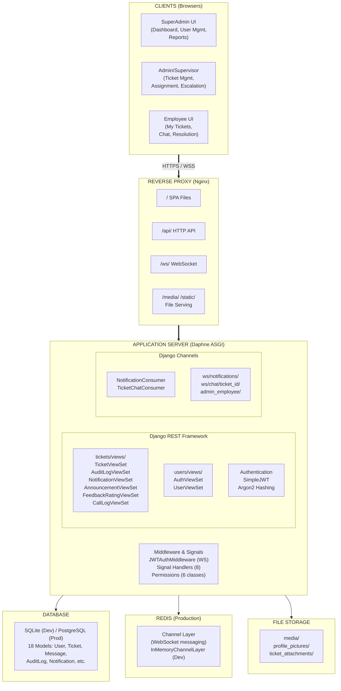

# 21. APPENDICES

## Appendix A: System Architecture Diagram



---

## Appendix B: Database Entity-Relationship Summary

### Core Entities

```
User (1) ─────────── (N) Ticket          [created_by]
User (1) ─────────── (N) AssignmentSession [assigned_to / assigned_by]
Ticket (1) ────────── (N) AssignmentSession
Ticket (1) ────────── (N) TicketAttachment
Ticket (1) ────────── (N) TicketTask
Ticket (1) ────────── (N) Message
Ticket (1) ────────── (N) EscalationLog
Ticket (1) ────────── (1) FeedbackRating
Message (1) ─────────(N) MessageReaction
Message (1) ─────────(N) MessageReadReceipt
User (1) ─────────── (N) Notification
User (1) ─────────── (N) CallLog          [caller / receiver]
User (1) ─────────── (N) AuditLog
TypeOfService (1) ── (N) Category
Category (1) ──────── (N) Ticket
Product (1) ────────── (N) Ticket
Client (1) ─────────── (N) Ticket
```

### Model Field Summary

| Model | Key Fields |
|-------|------------|
| **User** | email (PK), first_name, last_name, middle_name, role (employee/sales/admin/superadmin), department, phone, profile_picture, is_agreed_privacy_policy |
| **Ticket** | ticket_number, status, priority, category, product, client, created_by, sla_deadline, current_session |
| **AssignmentSession** | ticket, assigned_to, assigned_by, started_at, ended_at, is_active |
| **Message** | ticket, sender, content, message_type, parent_message, is_edited, is_deleted |
| **TicketAttachment** | ticket, file, uploaded_by, file_name, file_size, file_type |
| **TicketTask** | ticket, title, description, is_completed, completed_by, completed_at |
| **EscalationLog** | ticket, escalated_by, escalation_type, reason, previous_assignee, new_assignee |
| **AuditLog** | user, action, model_name, object_id, changes (JSON), ip_address |
| **Notification** | user, title, message, notification_type, is_read, related_ticket |
| **CallLog** | caller, receiver, related_ticket, call_type, duration, notes |
| **FeedbackRating** | ticket, employee, admin, rating, comments |
| **TypeOfService** | name, description, is_active |
| **Category** | name, type_of_service, description, is_active |
| **Product** | name, description, is_active |
| **Client** | name, email, phone, address, is_active |
| **RetentionPolicy** | name, duration_days, description, is_active |
| **Announcement** | title, content, author, priority, is_active, start_date, end_date, target_roles |
| **MessageReaction** | message, user, reaction_type |
| **MessageReadReceipt** | message, user, read_at |

---

## Appendix C: API Endpoint Reference

### Authentication Endpoints (`/api/auth/`)

| Method | Endpoint | Description |
|--------|----------|-------------|
| POST | `/api/auth/login/` | User login (returns JWT pair) |
| POST | `/api/auth/token/refresh/` | Refresh access token |
| POST | `/api/auth/logout/` | User logout |
| GET | `/api/auth/me/` | Get current user profile |
| POST | `/api/auth/upload_avatar/` | Upload profile picture |
| DELETE | `/api/auth/remove_avatar/` | Remove profile picture |
| PATCH | `/api/auth/update_profile/` | Update own profile |
| POST | `/api/auth/change_password/` | Change own password |
| POST | `/api/auth/password-reset/` | Request password reset (email) |
| POST | `/api/auth/password-reset-by-key/` | Reset password via recovery key |
| POST | `/api/auth/password-reset-confirm/` | Confirm password reset token + new password |

### User Endpoints (`/api/users/`)

| Method | Endpoint | Description |
|--------|----------|-------------|
| GET | `/api/users/list_users/` | List users (superadmin) |
| POST | `/api/users/create_user/` | Create user |
| PATCH | `/api/users/{id}/update_user/` | Update user |
| POST | `/api/users/{id}/toggle_active/` | Activate/deactivate user |
| POST | `/api/users/{id}/reset_password/` | Admin reset password |
| GET | `/api/auth/me/` | Current user profile |
| PATCH | `/api/auth/update_profile/` | Update own profile |
| POST | `/api/auth/change_password/` | Change own password |
| POST | `/api/auth/upload_avatar/` | Upload profile picture |

### Ticket Endpoints (`/api/tickets/`)

| Method | Endpoint | Description |
|--------|----------|-------------|
| GET | `/api/tickets/` | List tickets (filtered by role) |
| POST | `/api/tickets/` | Create ticket |
| GET | `/api/tickets/{id}/` | Retrieve ticket detail |
| PUT/PATCH | `/api/tickets/{id}/` | Update ticket |
| POST | `/api/tickets/{id}/assign/` | Assign ticket to technician |
| POST | `/api/tickets/{id}/escalate/` | Escalate ticket |
| POST | `/api/tickets/{id}/pass_ticket/` | Pass ticket to another technician |
| POST | `/api/tickets/{id}/start_work/` | Start working on ticket |
| POST | `/api/tickets/{id}/request_closure/` | Submit ticket for closure |
| POST | `/api/tickets/{id}/review/` | Review pending closure |
| POST | `/api/tickets/{id}/confirm_ticket/` | Confirm ticket |
| POST | `/api/tickets/{id}/close_ticket/` | Close ticket (admin-level) |
| POST | `/api/tickets/{id}/submit_for_observation/` | Set for observation period |
| POST | `/api/tickets/{id}/upload_resolution_proof/` | Upload proof of resolution |
| POST | `/api/tickets/{id}/escalate_external/` | Escalate ticket externally |
| PATCH | `/api/tickets/{id}/save_product_details/` | Save product detail snapshot |
| PATCH | `/api/tickets/{id}/update_employee_fields/` | Update employee ticket fields |
| POST | `/api/tickets/{id}/link_tickets/` | Link related tickets |
| GET | `/api/tickets/{id}/assignment_history/` | Get assignment history |
| GET | `/api/tickets/{id}/messages/` | Get ticket messages |
| GET | `/api/tickets/stats/` | Get ticket statistics |

### Notification Endpoints (`/api/notifications/`)

| Method | Endpoint | Description |
|--------|----------|-------------|
| GET | `/api/notifications/` | List user notifications |
| POST | `/api/notifications/mark_read/` | Mark selected notifications as read |
| POST | `/api/notifications/mark_all_read/` | Mark all notifications as read |
| POST | `/api/notifications/clear_all/` | Delete all notifications |

### Additional Endpoints

| Method | Endpoint | Description |
|--------|----------|-------------|
| GET | `/api/categories/` | List categories |
| GET | `/api/type-of-service/` | List service types |
| GET | `/api/products/` | List products |
| GET | `/api/clients/` | List clients |
| GET | `/api/audit-logs/` | List audit logs (admin+) |
| GET/POST | `/api/announcements/` | Manage announcements |
| GET/POST | `/api/feedback-ratings/` | Manage feedback ratings |
| GET/POST | `/api/call-logs/` | Manage call logs |
| GET/POST | `/api/retention-policy/` | Get/update retention policy |
| GET | `/api/knowledge-hub/` | Knowledge Hub attachments |
| GET | `/api/published-articles/` | Published Knowledge Hub articles |
| GET | `/api/employees/` | Employee list with active ticket counts |
| GET | `/api/sales-users/` | Active sales users |
| GET | `/api/supervisors/` | Active supervisors |

### WebSocket Endpoints

| Endpoint | Description |
|----------|-------------|
| `ws/notifications/` | Real-time notifications (authenticated) |
| `ws/chat/<ticket_id>/admin_employee/` | Real-time ticket chat (admin/employee) |

---

## Appendix D: Technology Stack Summary

### Backend

| Technology | Version | Purpose |
|------------|---------|---------|
| Python | 3.10+ | Runtime |
| Django | 4.2+ | Web framework |
| Django REST Framework | 3.16.1 | REST API |
| djangorestframework-simplejwt | 5.5.1 | JWT authentication |
| Django Channels | 4.3.2 | WebSocket support |
| Daphne | 4.1.2 | ASGI server |
| drf-yasg | 1.21.15 | Swagger/OpenAPI documentation |
| django-cors-headers | 4.7.0 | CORS handling |
| Pillow | 11.2.1 | Image processing |
| Whitenoise | 6.9.0 | Static file serving |
| argon2-cffi | 23.1.0 | Password hashing |
| python-dotenv | 1.1.0 | Environment configuration |

### Frontend (Primary — Maptech_FrontendUI-main)

| Technology | Version | Purpose |
|------------|---------|---------|
| React | 18.2.0 | UI framework |
| TypeScript | 5.5.4 | Type-safe JavaScript |
| React Router | 6.12.0 | Client-side routing |
| Tailwind CSS | 3.4.17 | Utility-first CSS |
| Vite | 5.0.0 | Build tool & dev server |
| Recharts | 2.12.7 | Data visualization |
| Lucide React | 0.503.0 | Icon library |
| Sonner | 2.0.1 | Toast notifications |
| xlsx-js-style | 1.2.0 | Excel export |
| js-cookie | 3.0.5 | Cookie management |

### Frontend (Legacy — frontend/)

| Technology | Version | Purpose |
|------------|---------|---------|
| React | 18.3.1 | UI framework |
| TypeScript | 5.5.4 | Type-safe JavaScript |
| React Router | 7.13.0 | Client-side routing |
| Tailwind CSS | 4.1.5 | Utility-first CSS |
| Vite | 5.2.0 | Build tool |
| @azure/msal-browser | 4.12.0 | Azure AD auth |
| @react-oauth/google | 0.12.1 | Google auth |
| React Hook Form | 7.56.4 | Form management |

---

## Appendix E: User Role Permissions Matrix

| Feature | SuperAdmin | Admin (Supervisor) | Sales | Employee (Technician) |
|---------|:----------:|:------------------:|:-----:|:---------------------:|
| View tickets | ❌ (no ticket UI) | ✅ | ✅ (own created) | ✅ (assigned only) |
| Create tickets | ❌ (no ticket UI) | ✅ | ✅ | ❌ |
| Assign tickets | ❌ | ✅ | ❌ | ❌ |
| Escalate tickets | ❌ | ✅ (external only) | ❌ | ✅ |
| Pass tickets | ❌ | ❌ | ❌ | ✅ |
| Close tickets (direct) | ❌ (no ticket UI) | ✅ | ❌ | ❌ |
| Request closure | ❌ | ❌ | ❌ | ✅ |
| Review/confirm call status | ❌ | ✅ | ✅ (own intake flow) | ❌ |
| Manage users | ✅ | ❌ | ❌ | ❌ |
| View audit logs | ✅ | ✅ | ✅ (scoped) | ❌ |
| Manage categories | ✅ | ✅ | ✅ | ❌ |
| Manage products | ✅ | ✅ | ✅ | ❌ |
| Manage clients | ✅ | ✅ | ✅ | ❌ |
| Send messages | ✅ | ✅ | ✅ | ✅ |
| Upload attachments | ❌ (no ticket UI) | ✅ | ✅ (ticket scope) | ✅ |
| View statistics | ✅ | ✅ | ✅ | ✅ (limited) |
| Manage announcements | ✅ | ❌ | ❌ | ❌ |
| Manage retention policies | ✅ | ❌ | ❌ | ❌ |

---

## Appendix F: Ticket Status Flow

```mermaid
stateDiagram-v2
    [*] --> OPEN : Ticket Created

    OPEN : OPEN
    IN_PROGRESS : IN PROGRESS
    ESCALATED : ESCALATED
    ESCALATED_EXT : ESCALATED EXTERNAL
    PENDING_CLOSURE : PENDING CLOSURE
    FOR_OBSERVATION : FOR OBSERVATION
    CLOSED : CLOSED
    UNRESOLVED : UNRESOLVED

    OPEN --> IN_PROGRESS : assign + start_work

    IN_PROGRESS --> ESCALATED : escalate
    IN_PROGRESS --> PENDING_CLOSURE : request_closure

    ESCALATED --> IN_PROGRESS : re-assign
    ESCALATED --> ESCALATED_EXT : external escalation

    PENDING_CLOSURE --> CLOSED : review + close
    PENDING_CLOSURE --> IN_PROGRESS : back to work
    PENDING_CLOSURE --> FOR_OBSERVATION : monitoring

    FOR_OBSERVATION --> CLOSED : confirm

    IN_PROGRESS --> UNRESOLVED : cannot resolve
```



**Status Definitions:**

| Status | Description |
|--------|-------------|
| `open` | Newly created, awaiting assignment |
| `in_progress` | Assigned to technician, actively being worked on |
| `escalated` | Escalated to higher-level support within the organization |
| `escalated_external` | Escalated to external/third-party support |
| `pending_closure` | Technician has requested closure, awaiting admin review |
| `for_observation` | Resolution applied, under observation period |
| `closed` | Ticket resolved and closed |
| `unresolved` | Ticket cannot be resolved |

---

## Appendix G: Glossary

| Term | Definition |
|------|------------|
| **ASGI** | Asynchronous Server Gateway Interface — Python standard for async web applications |
| **Assignment Session** | A record linking a technician to a ticket for a specific period |
| **Feedback Rating** | Supervisor/admin 1-5 rating of technical staff performance before ticket closure |
| **DRF** | Django REST Framework — toolkit for building REST APIs in Django |
| **Escalation** | Process of transferring a ticket to higher-level support |
| **JWT** | JSON Web Token — stateless authentication token format |
| **SLA** | Service Level Agreement — defined response/resolution time commitments |
| **SPA** | Single Page Application — client-side rendered web application |
| **WebSocket** | Full-duplex communication protocol over a single TCP connection |
| **Channel Layer** | Django Channels abstraction for message passing between consumers |
| **WAL** | Write-Ahead Logging — database transaction logging mechanism |
| **CORS** | Cross-Origin Resource Sharing — HTTP header mechanism for cross-domain requests |
| **ORM** | Object-Relational Mapping — technique for querying databases using objects |
| **Argon2** | Memory-hard password hashing algorithm (winner of Password Hashing Competition) |
| **HIBP** | Have I Been Pwned — service for checking if passwords appear in known data breaches |

---

## Appendix H: File Structure Reference

```
project-root/
├── backend/
│   ├── manage.py                    # Django management script
│   ├── requirements.txt             # Python dependencies
│   ├── db.sqlite3                   # Development database
│   ├── media/                       # User-uploaded files
│   │   ├── profile_pictures/
│   │   └── ticket_attachments/
│   ├── staticfiles/                 # Collected static files
│   ├── tickets/                     # Core ticketing app
│   │   ├── models/                  # Database models (10 files)
│   │   ├── views/                   # API views (7 files)
│   │   ├── serializers/             # DRF serializers
│   │   ├── migrations/              # Database migrations (20+)
│   │   ├── consumers.py             # WebSocket consumers
│   │   ├── routing.py               # WebSocket URL routing
│   │   ├── permissions.py           # Custom permission classes
│   │   ├── middleware.py             # JWT WebSocket middleware
│   │   ├── signals.py               # Django signal handlers
│   │   ├── admin.py                 # Django admin configuration
│   │   └── swagger.py               # API documentation config
│   ├── users/                       # User management app
│   │   ├── models.py                # Custom User model
│   │   ├── views.py                 # Auth & User ViewSets
│   │   ├── serializers.py           # User serializers
│   │   └── admin.py                 # User admin config
│   └── tickets_backend/             # Django project settings
│       ├── settings.py              # Main configuration
│       ├── urls.py                  # Root URL configuration
│       ├── asgi.py                  # ASGI application
│       └── wsgi.py                  # WSGI application
├── frontend/                        # Legacy frontend
│   ├── src/
│   │   ├── App.tsx
│   │   ├── admin/                   # Admin components
│   │   ├── employee/                # Employee components
│   │   ├── authentication/          # Auth components
│   │   ├── context/                 # React contexts
│   │   ├── services/                # API services
│   │   └── shared/                  # Shared components
│   └── package.json
├── Maptech_FrontendUI-main/         # Primary frontend
│   ├── src/
│   │   ├── App.tsx
│   │   ├── pages/                   # Page components
│   │   ├── components/              # Reusable components
│   │   ├── layouts/                 # Role-based layouts
│   │   ├── context/                 # State management
│   │   ├── services/                # API/WebSocket services
│   │   └── shared/                  # Shared utilities
│   └── package.json
└── documentation/                   # This documentation
    ├── README.md                    # Table of contents
    └── 01-21 section files
```

---

*End of Section 21 — End of Documentation*
